<h2>TensorFlow-FlexUNet-Image-Segmentation-Fazekas-Brain-Focal-Gliosis (Updated: 2026/10/03)</h2>
<h3>
Fazekas Detection: AI Generated Pseudo Masks Segmentation Challenge
</h3>
Sarah T. Arai 
Software Laboratory antillia.com 
 
This is the first experiment of Image Segmentation for <b>Fazekas-Brain-Focal-Gliosis</b>, 
 based on our 
<a href="https://github.com/sarah-antillia/TensorFlow-FlexUNet-Image-Segmentation-Model">
<b>TensorFlowFlexUNet Model </b>
</a>
(TensorFlow Flexible UNet Image Segmentation Model for Multiclass) 
and a 512x512-pixel PNG <b>Fazekas-Brain-Focal-Gliosis-ImageMask-Dataset</b>
which was derived by us from the Kaggle    
<a href="https://www.kaggle.com/datasets/trainingdatapro/fazekas-mri">
<b>Fazekas Detection - MRI Dataset</b></a>
 
<b>Brain MRI Dataset for focal gliosis detection with a report from the doctor</b>
  by Unique Data
 

<b>Acutual Image Segmentation for Fazekas-Brain-Focal-Gliosis Images of 512x512 pixels</b> 
As shown below, the inferred masks predicted by our segmentation model  appear similar to the 
ground truth masks.  
<b>class_color_map={SNFH (Surrounding non-enhancing FLAIR hyperintensity): white } </b>
  
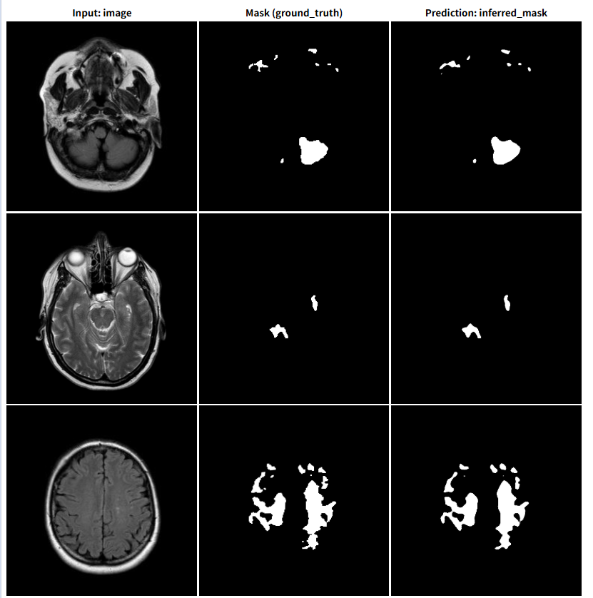
 
<!--
<table>
<tr>
<th>Input: image</th>
<th>Mask (ground_truth)</th>
<th>Prediction: inferred_mask</th>
</tr>
<tr>
<td></td>
<td></td>
<td></td>
</tr>
<tr>
<td></td>
<td></td>
<td></td>
</tr>
<tr>
<td></td>
<td></td>
<td></td>
</tr>
</table>
-->

<h3>1. Dataset Citation</h3>
The dataset used here was derived from    
<a href="https://www.kaggle.com/datasets/trainingdatapro/fazekas-mri">
<b>Fazekas Detection - MRI Dataset</b></a>
 
<b>Brain MRI Dataset for focal gliosis detection with a report from the doctor</b>
  by Unique Data
 
 
The following explanation (excerpt) was taken from the website above.  
<b>About Dataset</b> 
<b>Brain MRI Dataset, Fazekas I Detection & Segmentation</b> 
The dataset consists of .dcm files containing <b>MRI scans of the brain</b> of the person with a 
<b>focal gliosis of the brain (Fazekas I)</b>. The images are <b>labeled</b> by the doctors and accompanied by 
<b>report</b> in PDF-format.
 
The dataset includes 6 studies, made from the different angles which provide a comprehensive understanding of a Fazekas I.
  
<b>Types of diseases and conditions in the full dataset:</b> 
<ul>
<li>Cancer</li>
<li>Multiple sclerosis</li>
<li>Metastatic lesion</li>
<li>Arnold-Chiari malformation</li>
<li>Focal gliosis of the brain</li>
<li><b>AND MANY OTHER CONDITIONS</b></li>
</ul>
The dataset holds great value for researchers and medical professionals involved in oncology, radiology, 
and medical imaging. It can be used for a wide range of purposes, including developing and evaluating 
novel imaging techniques, training and validating machine learning algorithms for automated tumor 
detection and segmentation, analyzing tumor response to different treatments, 
and studying the relationship between imaging features and clinical outcomes.
  
<b>License</b> 
<a href="https://creativecommons.org/licenses/by-nc-nd/4.0/">
Attribution-NonCommercial-NoDerivatives 4.0 International</a>
  
<h3>
2. Fazekas-Brain-Focal-Gliosis ImageMask Dataset
</h3>
<h4>2.1 ImageMask Dataset</h4>
 If you would like to train this Fazekas-Brain-Focal-Gliosis Segmentation mode,
 please generate a dataset  
<b>Fazekas</b> Brain Focal Gliosis ImageMask dataset by yourself, and put it under <b>./dataset</b> folder.
 
<pre>
./dataset
└─Fazekas
    ├─test
    │   ├─images
    │   └─masks
    ├─train
    │   ├─images
    │   └─masks
    └─valid
        ├─images
        └─masks
</pre>
 
<b>Fazekas Statistics</b> 
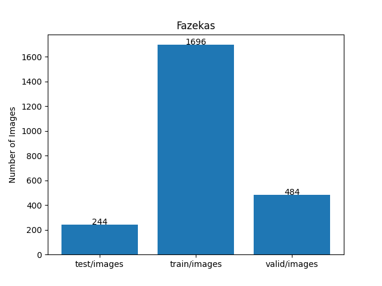 
 
As shown above, the number of images of train and valid datasets is large enough to use for a training set of our segmentation model.
 
 
<h4>2.2  Derivation of Fazekas ImageMask Dataset</h4>
The folder structure of the original <b>ST000001</b> is as follows,
but it contains no annotation (mask) files, because it is an image detection dataset.
 
<pre>
./ST000001
  ├─SE000001
  │  ├─IM000001.dcm
  │  ├─IM000001.jpg  
...
  │  ├─IM000025.dcm
  │  └─IM000025.jpg 
...
  └─SE000006
      ├─IM000001.dcm
      ├─IM000001.jpg 
...        
      ├─IM000028.dcm
      └─IM000028.jpg 
  
</pre>
<b>Step 1</b> 
We generated a 512x512-pixel PNG  master images from all JPG files in each 
<b>SE00000*</b> subfolders.
  

<b>Step 2</b> 
We generated the pseudo masks  
 corresponding to the master images by applying a segmentation (inference) 
method of a pretrained FlexUNet model 
<a href="https://github.com/sarah-antillia/TensorFlow-FlexUNet-Image-Segmentation-BraTS2024-Post-Treatment-Glioma-T2W-Subset">
TensorFlow-FlexUNet-Image-Segmentation-BraTS2024-Post-Treatment-Glioma-T2W-Subset
</a> to all master images.
  
<b>Step 3</b> 
We finally generated our own <b>Fazekas-Brain-Focal-Gliosis-Master </b>
from all pairs of the master images and their corresponding pseudo masks for  
<b>SNFH (Surrounding non-enhancing FLAIR hyperintensity)</b> class only.
For more detail, please refer to our Python <a href="./generator/ImageMaskDatasetGenerator.py">ImageMaskDatasetGenerator.py</a>
  
<b>Note</b> 
<b>
You may not redistribute this ImageMask dataset generated from the 
<a href="https://www.kaggle.com/datasets/trainingdatapro/fazekas-mri">
<b>Fazekas Detection - MRI Dataset</b></a> 
(<a href="https://creativecommons.org/licenses/by-nc-nd/4.0/">
Attribution-NonCommercial-NoDerivatives 4.0 International</a>).
</b>  
<h4>2.3 Image and Mask samples</h4>
<b>Train_images_sample</b> 
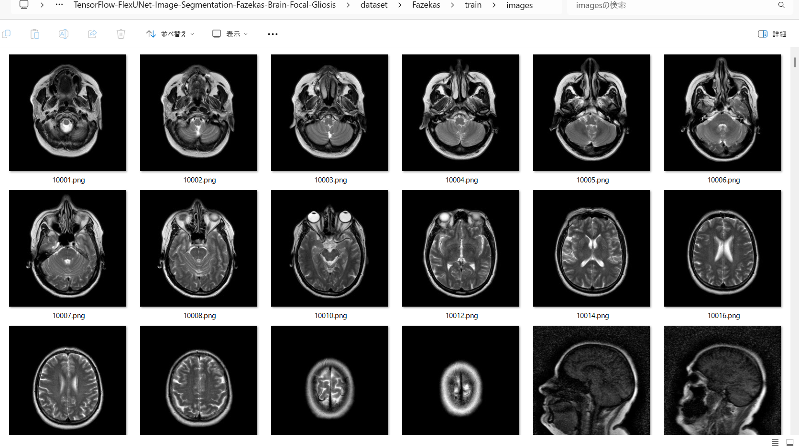
 
<b>Train_masks_sample</b> 
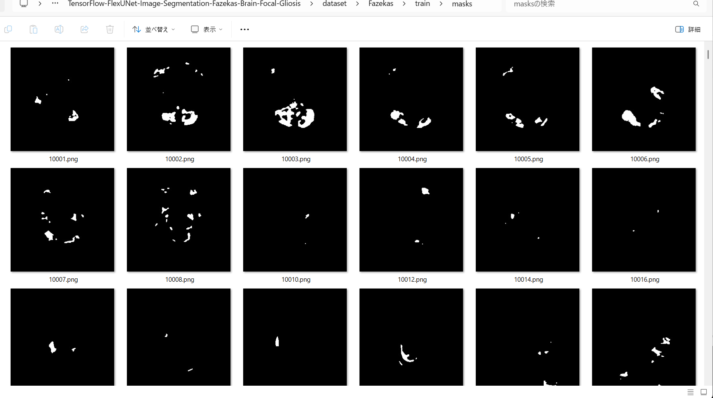
 
<h3>
3. Train TensorFlowFlexUNet Model
</h3>
 We trained Fazekas-Brain-Focal-Gliosis TensorFlowFlexUNet Model by using the following
<a href="./projects/TensorFlowFlexUNet/Fazekas/train_eval_infer.config"> <b>train_eval_infer.config</b></a> file.  
Please move to <b>./projects/TensorFlowFlexUNet/Fazekas</b> foder, and run the following bat file. 
<pre>
>1.train.bat
</pre>
This simply runs the following command. 
<pre>
>python ../../../src/TensorFlowFlexUNetTrainer.py ./train_eval_infer.config
</pre>

<b>Model parameters</b> 
Defined a small <b>base_filters = 16 </b> and large <b>base_kernels = (11,11)</b> for the first Conv Layer of Encoder Block of 
<a href="./src/TensorFlowFlexUNet.py">TensorFlowFlexUNet.py</a> 
and a large <b>num_layers = 8</b> (including a bridge between Encoder and Decoder Blocks).
<pre>
[model]
;You may specify your own UNet class derived from our TensorFlowFlexModel
model         = "TensorFlowFlexUNet"
generator     =  False
image_width    = 512
image_height   = 512
image_channels = 3
num_classes    = 2
base_filters   = 16
base_kernels   = (11,11)
num_layers     = 8
dropout_rate   = 0.05
; Specified a large dilation
dilation       = (3,3)
</pre>
<b>Learning rate</b> 
Defined a very small learning rate.  
<pre>
[model]
learning_rate  = 0.00007
</pre>
<b>Loss and metrics functions</b> 
<pre>
loss           = "categorical_focal_dice_loss"
metrics        = ["dice_coef_hybrid"]
hybrid_alpha   = 1.6
hybrid_beta    = 0.4
</pre>
<b>Dataset class</b> 
Specifed <a href="./src/ImageCategorizedMaskDataset.py">ImageCategorizedMaskDataset</a> class. 
<pre>
[dataset]
class_name    = "ImageCategorizedMaskDataset"
</pre>
 
<b>Learning rate reducer callback</b> 
Enabled learing_rate_reducer callback, and a small reducer_patience.
<pre> 
[train]
learning_rate_reducer = True
reducer_factor     = 0.5
reducer_patience   = 4
</pre>
<b>Early stopping callback</b> 
Enabled early stopping callback with patience parameter.
<pre>
[train]
patience      = 10
</pre>

<b>RGB Color map</b> 
rgb color map dict for Fazekas-Brain-Focal-Gliosis 1+2 classes. 
<pre>
[mask]
mask_datatyoe    = "categorized"
mask_file_format = ".png"
;                    SNFH (Surrounding non-enhancing FLAIR hyperintensity): white    
rgb_map = {(0,0,0):0,(255,255,255):1,}
</pre>

<b>Epoch change inference callback</b> 
Enabled <a href="./src/EpochChangeInfereuncer.py">epoch_change_infer callback</a></b>. 
<pre>
[train]
epoch_change_infer       = True
epoch_change_infer_dir   =  "./epoch_change_infer"
num_infer_images         = 6
</pre>

By using this callback, on every epoch_change, the inference procedure can be called
 for 6 images in <b>mini_test</b> folder. This will help you confirm how the predicted mask changes 
 at each epoch during your training process.    

<b>Epoch_change_inference output at starting (epoch 1,2,3)</b> 
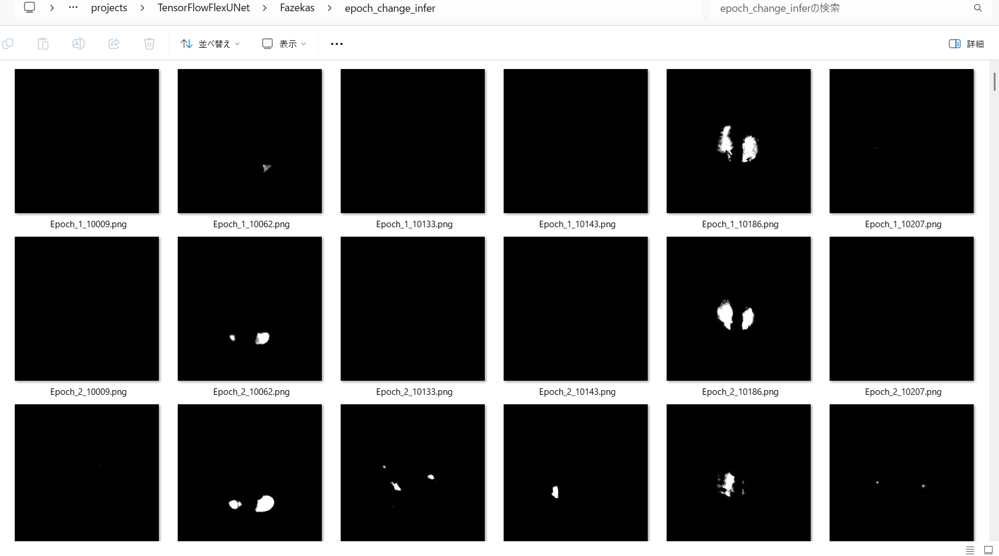 
 
<b>Epoch_change_inference output at middlepoint (epoch 33,34,35)</b> 
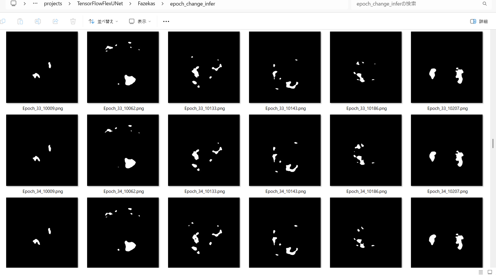 
 
<b>Epoch_change_inference output at ending (epoch 68,69,70)</b> 
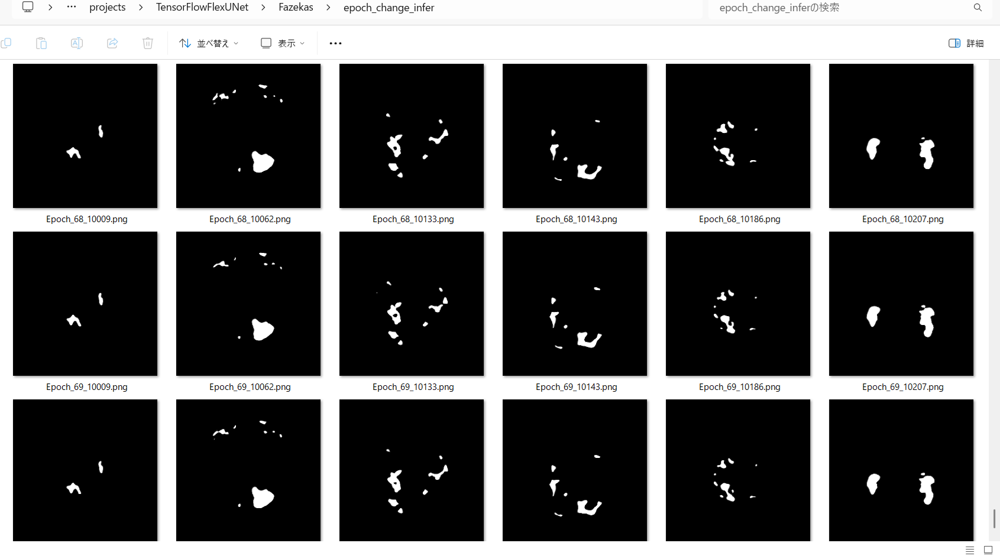 
 
In this experiment, the training process was terminated at epoch 70.  
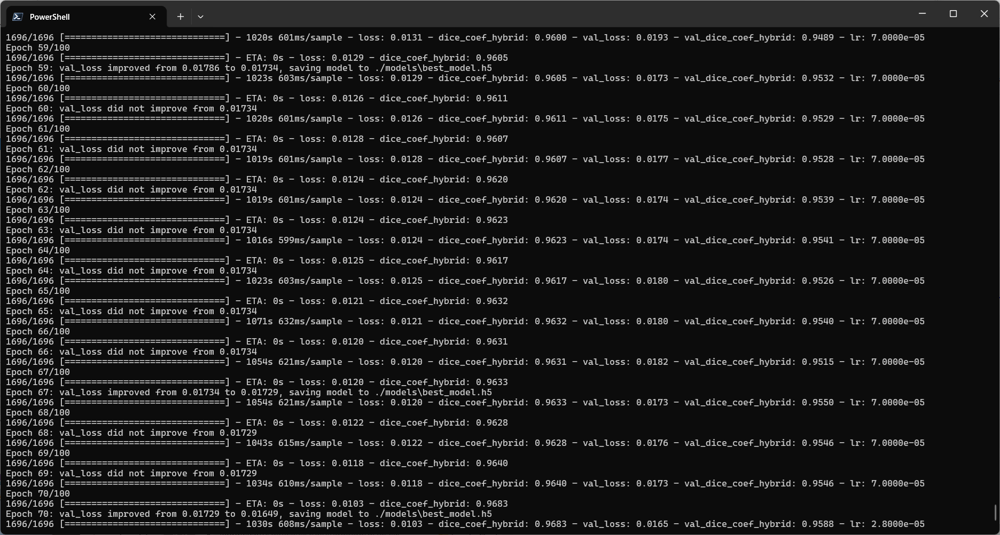 
 

<a href="./projects/TensorFlowFlexUNet/Fazekas/eval/train_metrics.csv">train_metrics.csv</a> 
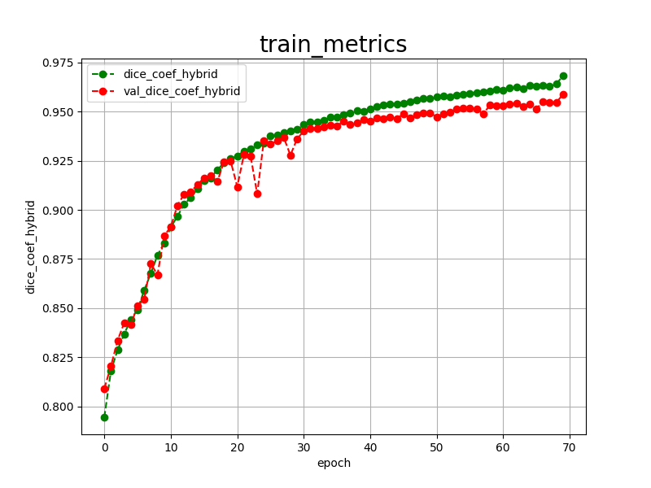 

 
<a href="./projects/TensorFlowFlexUNet/Fazekas/eval/train_losses.csv">train_losses.csv</a> 
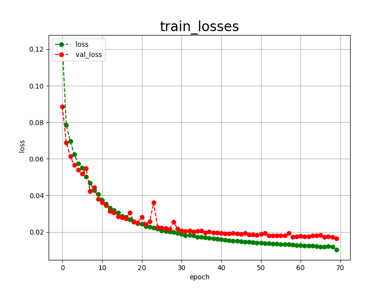 

 
<h3>
4. Evaluation
</h3>
Please move to <b>./projects/TensorFlowFlexUNet/Fazekas</b> folder, 
and run the following bat file to evaluate TensorFlowFlexUNet model for Fazekas-Brain-Focal-Gliosis. 
<pre>
>./2.evaluate.bat
</pre>
This simply runs the following command.
<pre>
>python ../../../src/TensorFlowFlexUNetEvaluator.py ./train_eval_infer.config
</pre>

Evaluation console output: 
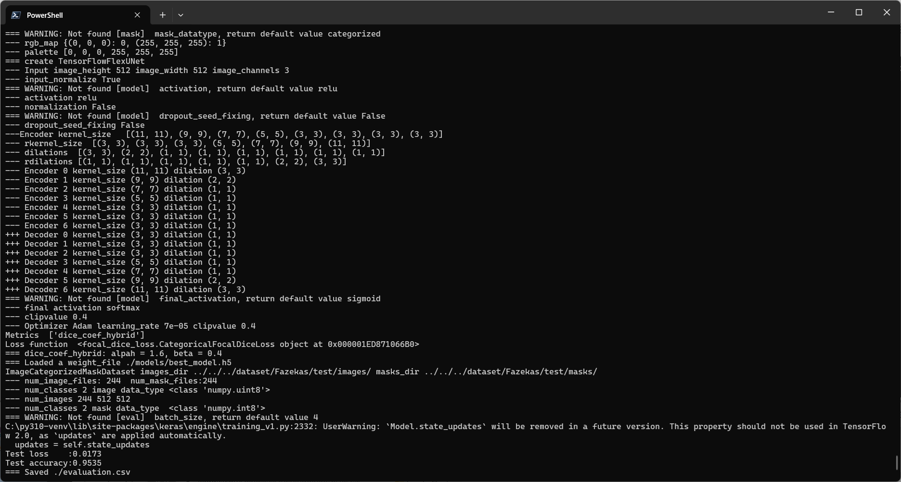
  

<a href="./projects/TensorFlowFlexUNet/Fazekas/evaluation.csv">evaluation.csv</a> 
The loss (categorical_focal_dice_loss) to this Fazekas/test was low, and dice_coef_hybrid was high as shown below.
 
<pre>
categorical_focal_dice_loss,0.0173
dice_coef_hybrid,0.9535
</pre>
 

<h3>
5. Inference
</h3>
Please move <b>./projects/TensorFlowFlexUNet/Fazekas</b> folder, and run the following bat file to infer segmentation regions for images by the Trained-TensorFlowFlexUNet model for Fazekas-Brain-Focal-Gliosis. 
<pre>
>./3.infer.bat
</pre>
This simply runs the following command.
<pre>
>python ../../../src/TensorFlowFlexUNetInferencer.py ./train_eval_infer.config
</pre>

<b>mini_test_images</b> 
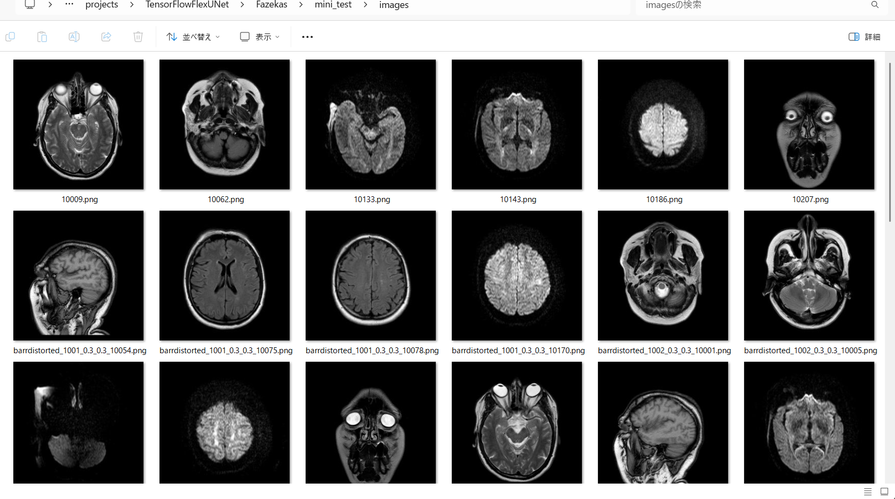 
<b>mini_test_mask(ground_truth)</b> 
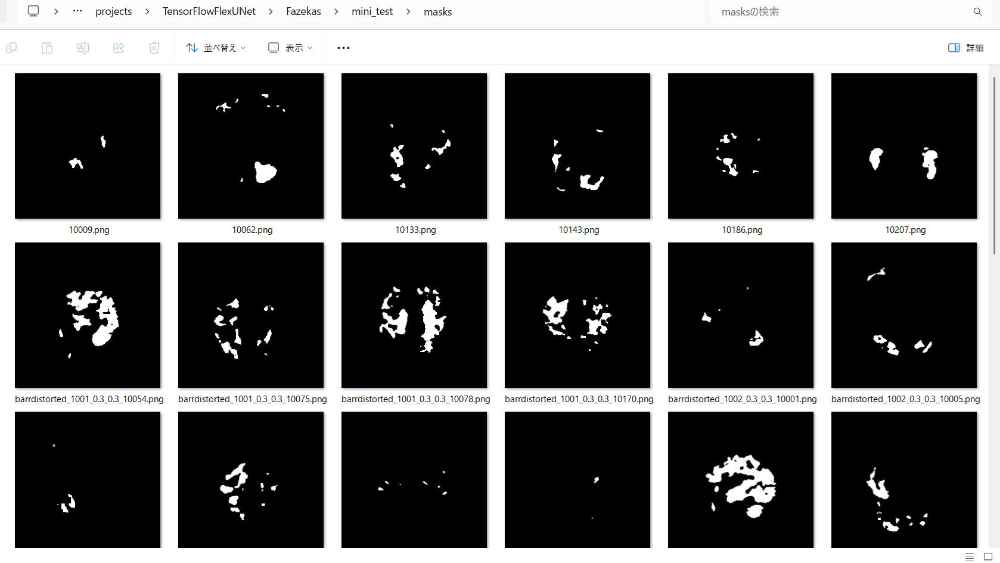 

<b>Inferred test masks</b> 
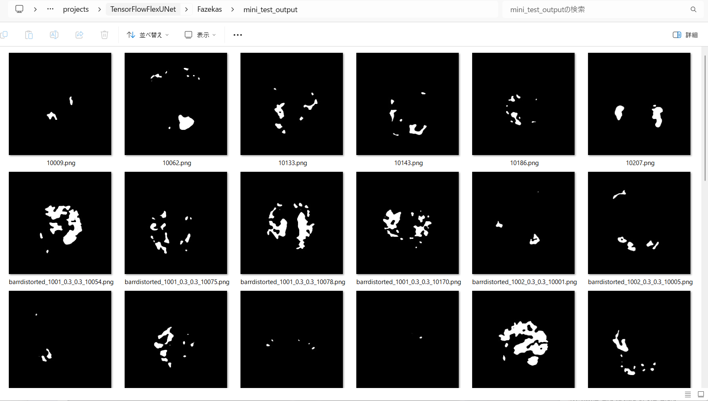 
 

<b>Acutual Image Segmentation for Fazekas-Brain-Focal-Gliosis Images of 512x512 pixels</b> 
As shown below, the inferred masks predicted by our segmentation model appear similar to the ground truth masks.  
<b>class_color_map={SNFH (Surrounding non-enhancing FLAIR hyperintensity): white } </b>
  
<table>
<tr>
<td>
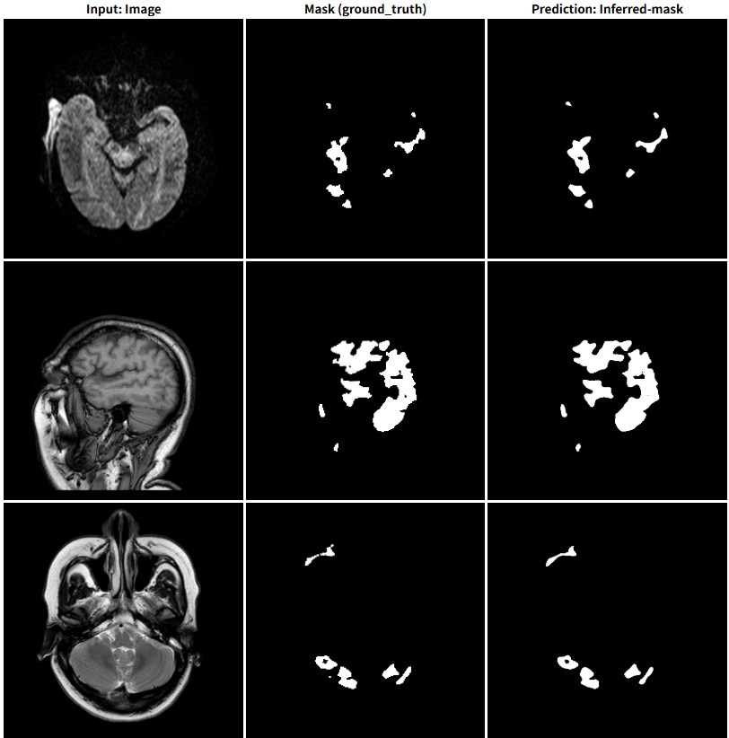
</td>
</tr>
<tr>
<td>
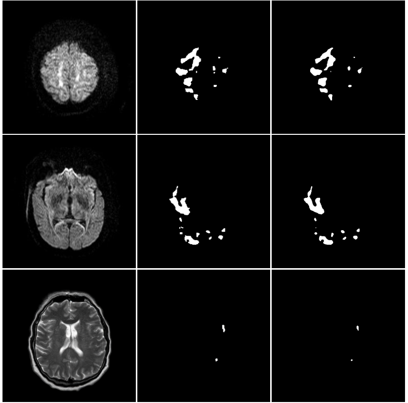
</td>
</tr>
</table>
<!--
<table>
<tr>
<th>Input: Image</th>
<th>Mask (ground_truth)</th>
<th>Prediction: Inferred-mask</th>
</tr>
<tr>
<td></td>
<td></td>
<td></td>
</tr>
<tr>
<td></td>
<td></td>
<td></td>
</tr>
<tr>
<td></td>
<td></td>
<td></td>
</tr>
<tr>
<td></td>
<td></td>
<td></td>
</tr>
<tr>
<td></td>
<td></td>
<td></td>
</tr>
<tr>
<td></td>
<td></td>
<td></td>
</tr>
</table>
-->

 
<h3>References</h3>
<b>1. Gliosis in the Brain: Causes, Diagnosis, and Implications</b> 
<a href="https://neurolaunch.com/gliosis-brain/">https://neurolaunch.com/gliosis-brain/</a>
 
 
<b>2. Gliosis on an MRI: What This Finding Means</b> 
<a href="https://biologyinsights.com/gliosis-on-an-mri-what-this-finding-means/">
https://biologyinsights.com/gliosis-on-an-mri-what-this-finding-means/
</a>
  
<b>3. Gliosis</b> 
<a href="https://radiopaedia.org/articles/gliosis">
https://radiopaedia.org/articles/gliosis
</a>
  
<b>4. TensorFlow-FlexUNet-Image-Segmentation-BraTS2024-Post-Treatment-Glioma-T2W-Subset</b> 
Toshiyuki Arai 
<a href="https://github.com/sarah-antillia/TensorFlow-FlexUNet-Image-Segmentation-BraTS2024-Post-Treatment-Glioma-T2W-Subset">
https://github.com/sarah-antillia/TensorFlow-FlexUNet-Image-Segmentation-BraTS2024-Post-Treatment-Glioma-T2W-Subset
</a>
 
 
<b>5. TensorFlow-FlexUNet-Image-Segmentation-Model</b> 
Toshiyuki Arai 
<a href="https://github.com/sarah-antillia/TensorFlow-FlexUNet-Image-Segmentation-Model">
https://github.com/sarah-antillia/TensorFlow-FlexUNet-Image-Segmentation-Model
</a>

